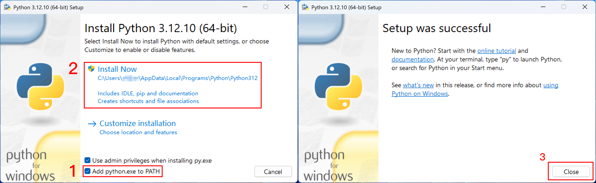

# autoContents

**当前版本：v1.1.0**

autoContents 是一款专为扫描版 PDF 设计的书签全自动生成工具，能够基于目录页内容创建可跳转书签。上传 PDF 文档后无需进行任何其他操作，等待 1 分钟左右即可获取处理结果。

本仓库基于 [NatsUIJM/autoContents](https://github.com/NatsUIJM/autoContents) 修改，主要改动如下：

- **支持任意 OpenAI 兼容的 LLM 服务商**（通义千问、书生·浦语、OpenAI、DeepSeek 等），不再局限于通义千问
- 所有硬编码模型名改为**变量/配置读取**，可通过 `.env` 文件或网页 UI 随时切换模型
- 修复了 Windows 下 `windows_start.bat` 在 PowerShell 中的兼容性问题
- 前端错误信息增强：子进程的 `stderr` 会直接显示在页面上，便于排查问题
- 增加 PDF 文件完整性预检（页数为 0 时提前报错）
- **支持罗马数字页码**（v1.1.0）：自动识别前言/序言的罗马数字页码（如 xv、xviii），计算前言偏移量，排序时副文本正确置于正文之前
- **支持拖拽上传 PDF**（v1.1.0）：可直接将 PDF 文件拖入网页，无需点击按钮选择

## 更新日志

### v1.1.0
- 新增罗马数字页码支持：`roman_to_int()` 转换函数，前言偏移自动计算（`calculate_roman_offset`），并发采样前言页面
- 修复前言目录排序：罗马数字条目（Foreword、Preface 等）正确排在正文章节之前
- 新增拖拽上传：PDF 文件可直接拖入网页，带蓝色高亮反馈
- 前端错误信息增强：显示子进程 `stderr`，便于排查

### v1.0.0
- 支持任意 OpenAI 兼容 LLM 服务商
- 硬编码模型名改为变量/配置读取（三层配置体系）
- 修复 Windows PowerShell 启动兼容性
- PDF 文件完整性预检

如果想先看看该工具的实际表现情况，请[点击这里](https://www.bilibili.com/video/BV14wKGeQEvr)。

## 适用文档

适用于全部自带目录页面的中英文文档。

## Step 1 下载程序

请点击页面顶部的绿色按钮`Code`，然后点击`Download ZIP`以下载程序源码。

## Step 2 配置环境

### 2.1 配置 LLM 服务

本工具需要使用支持**视觉/多模态**的 LLM 模型来识别 PDF 目录页图片。你可以选择任意 OpenAI 兼容的 LLM 服务商。

<details>
<summary><b>方式一：通义千问（阿里云百炼）</b></summary>

1. 注册账号：如果没有阿里云账号，请先[注册](https://account.aliyun.com/register/qr_register.htm?)一个。
2. 实名认证：参考[实名认证文档](https://help.aliyun.com/zh/account/user-guide/individual-identities?)对阿里云账号进行实名认证。
3. 获取 API Key：前往[百炼控制台（API-KEY管理）](https://bailian.console.aliyun.com/?tab=model#/api-key)然后创建一个 API-KEY。
4. 如果你有高校学生或教师身份，可前往[阿里云高校计划](https://university.aliyun.com)申请一些优惠。具体政策以该网页为准。

</details>

<details>
<summary><b>方式二：书生·浦语（InternAI）</b></summary>

1. 前往 [InternAI](https://chat.intern-ai.org.cn/) 注册并登录。
2. 在个人中心获取 API Key。
3. 可选模型：`intern-latest`、`internvl-latest` 等（详见 [模型列表](https://internlm.intern-ai.org.cn/docEn/docs/Models/)）。

</details>

<details>
<summary><b>方式三：其他 OpenAI 兼容服务商</b></summary>

任意提供 OpenAI 兼容 API 的服务商均可使用，只需提供：
- **API Key**
- **Base URL**（服务端点）
- **模型名称**（须支持视觉/多模态）

</details>

### 2.2 配置运行环境

<details>
<summary><b>Windows</b></summary>

1. [点击这里](https://www.python.org/ftp/python/3.13.13/python-3.13.13-amd64.exe)下载Python安装程序。下载完成后双击打开，然后按照下图依次操作：勾选`Add python.exe to PATH` -> 点击`Install Now` -> 安装完成后，点击`Close`。



2. 双击根目录下的`windows_install.bat`，直到运行完成（`Setup complete.`）。

</details>

<details>
<summary><b>macOS</b></summary>

1. [点击这里](https://www.python.org/ftp/python/3.13.13/python-3.13.13-macos11.pkg)下载Python安装程序。下载完成后直接安装即可。
2. 打开"终端"APP，输入`chmod +x `（注意最后面有空格），然后将`macos_install.command`文件拖入终端窗口，按`return`。

</details>

### 2.3 配置 LLM 凭证（.env 文件）

将 `.env.example` 复制为 `.env`，并填写你的 LLM 服务信息：

```bash
OPENAI_API_KEY=你的API密钥
OPENAI_BASE_URL=你的服务端点
OPENAI_MODEL=模型名称
```

也可以跳过此步，直接在启动后的网页 UI 中填写配置（见 Step 3.1）。

## Step 3 使用方法

### 3.1 运行程序

1. 双击根目录下的`windows_start.bat`或`macos_start.command`来启动程序，浏览器界面会自动打开。
2. 如果浏览器未打开，请在弹出的命令行窗口中找到`http://127.0.0.1:5xxx`，并复制到浏览器以打开。
3. 在网页的「LLM 配置管理」中填写 `API 密钥`、`Base URL`、`模型名称`，然后点击`保存 LLM 配置`。可点击「测试 LLM 服务」验证配置是否正常。

> **配置优先级**：网页 UI 实时配置 > `static/llm_config.json` 配置文件 > `.env` 环境变量

### 3.2 上传 PDF 并处理

1. 点击"选择PDF文件"，然后选择需要处理的 PDF 文件。
2. 点击"开始执行"，等待进度条走完，浏览器会自动下载带有书签的 PDF 文件。
3. 关于结果：
    1. 如果效果不错，请前往页面右上方，为这个项目增加一个`Star`，谢谢！
    2. 如果目录层级有误，请参见下方的`编辑书签`条目，或者使用自己的PDF编辑器进行相关操作。
    3. 如果运行出现问题，请参见下方的`疑难解答`以进行问题排查。

## 编辑书签

该项目提供简易的书签编辑工具，可使用`contents_editor`中的脚本对 PDF 文件的书签进行编辑，使用方法如下：

1. 将需要编辑的 PDF 文件放入`contents_editor`文件夹中；
2. 运行`windows_extract.bat`或`macos_extract.command`脚本，进行目录提取；
3. 使用`Microsoft Excel`，`VScode`或其他任何可编辑`csv`文件的软件编辑生成的`csv`文件：如果需要添加条目，那么插入一行；如果需要删除条目，那么删除对应行；如果只需要修改条目，那么修改对应行；
4. 保存并关闭`csv`文件，然后再运行`windows_merge.bat`或`macos_merge.command`脚本，将修改后的目录与 PDF 文件合并；
5. 该目录下的`*_edited.pdf`文件即为处理后的 PDF 文件。

## 疑难解答

- **`ModuleNotFoundError: No module named 'fitz'`**：虚拟环境中缺少 PyMuPDF 依赖，请运行 `pip install -r requirements.txt` 重新安装。
- **`PDF 文件无法解析出任何页面（页数为 0）`**：PDF 文件可能已损坏（trailer 缺失），请重新获取完好的 PDF 文件。
- **LLM 服务测试失败**：请检查 API Key、Base URL 和模型名称是否正确，以及模型是否支持视觉/多模态输入。
- **执行失败但看不到具体错误**：错误信息会显示在任务日志中，请向上滚动查看 `stderr` 输出的详细报错。

## MCP 服务器（可选，供 AI Agent 调用）

autoContents 也可作为 MCP（Model Context Protocol）服务器运行，让 AI 编程助手（如 Cherry Studio、Claude Desktop）直接调用书签生成能力。

### 安装 uv

[uv](https://docs.astral.sh/uv/) 是 Python 的快速包管理器，也是 MCP 服务器的运行环境。

**Windows**

```powershell
powershell -ExecutionPolicy ByPass -c "irm https://astral.sh/uv/install.ps1 | iex"
```

**macOS / Linux**

```bash
curl -LsSf https://astral.sh/uv/install.sh | sh
```

### 配置 MCP 客户端

将以下 JSON 添加到你的 MCP 客户端配置文件中（路径按实际情况修改）：

```json
{
  "mcpServers": {
    "autoContents": {
      "command": "uv",
      "args": [
        "run",
        "--project",
        "/path/to/autoContents",
        "python",
        "/path/to/autoContents/mcp_server.py"
      ],
      "env": {
        "AUTOCONTENTS_API_KEY": "sk-xxx",
        "AUTOCONTENTS_BASE_URL": "https://dashscope.aliyuncs.com/compatible-mode/v1",
        "AUTOCONTENTS_MODEL": "qwen3.7-plus"
      }
    }
  }
}
```

| 字段 | 说明 |
|------|------|
| `command` | 固定为 `uv`，需先完成上一步的安装 |
| `args` 中的路径 | 将 `/path/to/autoContents` 替换为项目实际路径 |
| `AUTOCONTENTS_API_KEY` | 必填，替换为你的百炼 API Key |
| `AUTOCONTENTS_BASE_URL` | 可选，默认为百炼兼容接口 |
| `AUTOCONTENTS_MODEL` | 可选，默认为 `qwen3.5-397b-a17b` |

配置完成后重启客户端，即可使用 `generate_pdf_bookmarks` 和 `check_llm_config` 两个工具。

### 更新日志

**更新提醒：最新版本是2026年7月26日发布的，你可以根据[获取更新](#获取更新)来更新程序。**

10月13日的版本对识别逻辑进行了完全重构，可实现**任意版面结构**的目录数据提取，同时处理速度提升50%，且进一步简化了配置流程；12月2日的版本支持直接在前端进行提示词修改；3月25日发布的版本支持自定义LLM服务；3月29日发布的版本增加了使用LLM对下载文件进行重命名的功能，特别鸣谢[@Little-White3110](https://github.com/Little-White3110)提出的建议；4月4日发布的版本实现的全自动目录提取。4月6日的版本对项目结构再次进行大量重构，解决了很多细节问题。7月26日的版本增加了`uv`和MCP支持。

## 获取更新

1. 点击页面顶部的绿色按钮`Code`，然后点击`Download ZIP`以下载程序源码；
2. 将下载的`autoContents-main`文件夹中的全部内容覆盖到本地`autoContents-main`文件夹中；
3. 重新运行`2.2`的安装步骤以更新依赖。

## Star History

[](https://star-history.com/#4965898/autoContents&Date)
