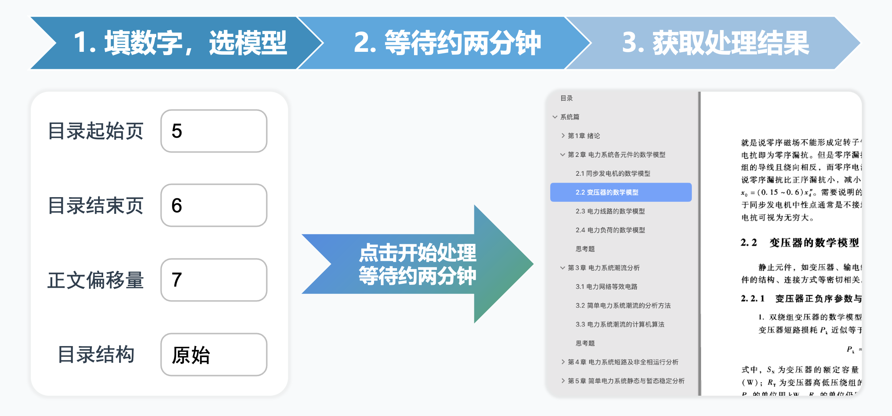

# autoContents

**更新提醒：最新版本是2025年10月13日发布的，你可以根据[获取更新](#获取更新)来更新程序。**

10月13日的版本对识别逻辑进行了完全重构，可实现**任意版面结构**的目录数据提取，同时处理速度提升50%；且进一步简化了配置流程，强烈推荐更新。

## 项目概述

autoContents 是一款专为扫描版 PDF 设计的书签全自动生成工具，能够基于目录页内容创建可跳转书签。如果想先看看该工具的实际表现情况，请[点击这里](https://www.bilibili.com/video/BV14wKGeQEvr)。它的工作流程大概是这样的：



## 适用文档

1. 支持目录页为任意版面结构的文档。
2. 适用的文档长度无理论上限。
3. 支持中文/英文及中英混合目录。

## Step 1 下载程序

请点击页面顶部的绿色按钮`Code`，然后点击`Download ZIP`以下载程序源码。

## Step 2 配置环境

### 2.1 申请通义千问 API-KEY

1. 注册账号：如果没有阿里云账号，请先[注册](https://account.aliyun.com/register/qr_register.htm?spm=a2c4g.11186623.0.0.5f7c5bbfotWlj8&oauth_callback=https%3A%2F%2Fbailian.console.aliyun.com%2F%3FapiKey%3D1)一个。
2. 实名认证：参考[实名认证文档](https://help.aliyun.com/zh/account/user-guide/individual-identities?spm=a2c4g.11186623.0.0.5f7cb0a8OQmG74)对阿里云账号进行实名认证。
3. 开通百炼：前往[百炼控制台（模型广场）](https://bailian.console.aliyun.com/?spm=a2c4g.11186623.0.0.5f7c5bbfotWlj8#/model-market)，开通百炼模型服务。
4. 获取 API Key：前往[百炼控制台（API-KEY管理）](https://bailian.console.aliyun.com/?tab=model#/api-key)然后创建一个 API-KEY，它以`sk-`开头。在此处获取的 API-KEY 请务必保管好，在下一步会用到。
5. 如果你有高校学生或教师身份，可前往[阿里云高校计划](https://university.aliyun.com)申请一些优惠。具体政策以该网页为准。

### 2.2 配置运行环境

#### 2.2.1 Windows 用户

1. 右键点击`setup_documents`文件夹中的`windows_install.bat`，选择`以管理员身份运行`，等待脚本运行完成。如果该脚本执行完成且无报错信息，表明上述所有操作均为正确操作。
2. 按下`Windows徽标键+R`打开`运行`，然后在输入框中输入如下命令（其中`sk-xxx`的内容需替换为上第一步获取的`sk-`开头的API-KEY），然后点击`运行`。运行后命令行弹窗闪一下后退出是正常的。

```cmd
powershell -Command "[Environment]::SetEnvironmentVariable('DASHSCOPE_API_KEY', 'sk-xxx', 'User')"
```

3. 如果想要确定上一步是否成功设置，可再次打开`运行`并输入如下命令。若弹出的命令行窗口第一行显示`sk-`开头的内容，表示设置成功。

```cmd
powershell -NoExit -Command "echo %DASHSCOPE_API_KEY%"
```

#### 2.2.2 macOS 用户

1. 打开“终端”APP，输入`chmod +x `（注意最后面有空格；注意是`+x`不是`-x`），然后将`setup_documents`文件夹中的`macos_install.sh`文件拖入终端窗口，按`return`。
2. 将`macos_install.sh`文件拖入终端窗口，按`return`，然后根据提示进行安装。
    - 如果未安装`Xcode CLI Tools`，会先安装该程序。安装完成后，请再次将`macos_install.sh`文件拖入终端窗口，按`return`，进行后续步骤。
    - 输入密码时，输入的内容并不会显示在屏幕上，输入完成后按`return`即可。
3. 重新打开“终端”APP，输入`sudo `（注意最后面有空格），然后再将`macos_install.sh`文件拖入终端窗口，按`return`，等待脚本执行完成。如果该脚本执行完成且无报错信息，表明上述所有操作均为正确操作。
4. 输入如下命令（其中`sk-xxx`的内容需替换为上第一步获取的`sk-`开头的API-KEY）并`return`执行。

```bash
export DASHSCOPE_API_KEY="sk-xxx"
```

5. 如果想要确定上一步是否成功设置，需关闭当前终端窗口，然后打开一个新的终端窗口，在其中运行如下命令。若运行结果为`sk-`开头的内容，表示设置成功。

```bash
echo $DASHSCOPE_API_KEY
```

## Step 3 使用方法

### 3.1 运行程序

1. 双击根目录下的`windows_start.bat`或`macos_start.command`来启动程序，浏览器界面会自动打开。
2. 如果浏览器未打开，请在弹出的命令行窗口中找到`http://127.0.0.1:5xxx`，并复制到浏览器以打开。

### 3.2 上传 PDF 并处理

1. 点击“选择PDF文件”，然后选择需要处理的 PDF 文件。
2. 填写 PDF 数据：目录起始页指的是目录的第一页是 PDF 文件的第几页；目录结束页指的是目录的最后一页是 PDF 文件的第几页；正文偏移量是指 PDF 页码与实际页码的差值，比如书籍的第 10 页是 PDF 文件的第 20 页，那么该值为 20 - 10 = 10。
3. 点击“开始执行”，等待进度条走完，浏览器会自动下载带有书签的 PDF 文件。

## 更多内容

### 编辑书签

该项目提供简易的书签编辑工具，可使用`contents_editor`中的脚本对 PDF 文件的书签进行编辑，使用方法如下：

1. 将需要编辑的 PDF 文件放入`contents_editor`文件夹中；
2. 运行`windows_extract.bat`或`macos_extract.command`脚本，进行目录提取；
3. 使用`Microsoft Excel`，`Numbers`，`VSCode`或其他任何可编辑`csv`文件的软件编辑生成的`csv`文件：如果需要添加条目，那么插入一行；如果需要删除条目，那么删除对应行；如果只需要修改条目，那么修改对应行；
4. 保存并关闭`csv`文件，然后再运行`windows_merge.bat`或`macos_merge.command`脚本，将修改后的目录与 PDF 文件合并；
5. 该目录下的`*_edited.pdf`文件即为处理后的 PDF 文件。

### 疑难解答

请阅读[常见问题解答](./docs/问题排查方案.md)进行问题排查。

### 获取更新

1. 点击页面顶部的绿色按钮`Code`，然后点击`Download ZIP`以下载程序源码；
2. 将下载的`autoContents-main`文件夹中的全部内容覆盖到本地`autoContents-main`文件夹中；
3. 重新运行`2.2.1`的第`1`步或`2.2.2`的`1-3`步。

## Star History

[](https://star-history.com/#NatsUIJM/autoContents&Date)
